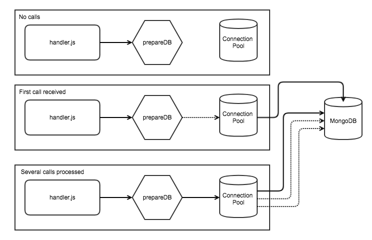

# OpenFaaS with MongoDB

This is a simple example of how to use connection pooling in MongoDB with OpenFaaS on Kubernetes.



1. In the first sequence we've had no calls made to the function, so the connection pool is not yet initialized. `prepareDB()` was never called.

2. In the second sequence `prepareDB()` has been called and since there was no instance of a connection in memory, we create one and you see the dotted line shows the connection being established. This will then open a connection to MongoDB in the network.

3. In the third sequence we see that subsequent calls detect a connection exists and go straight to the connection pool. We have one active connection and two shown with dotted lines which are about to be closed due to inactivity.

## Pre-requisites

Before we can build and deploy the example we'll set up OpenFaaS on Kubernetes or Swarm followed by MongoDB. This configuration is suitable for development and testing.

### Kubernetes

* 1. Install OpenFaaS with helm

https://docs.openfaas.com/deployment/kubernetes/

* 2. Install the OpenFaaS CLI

```bash
curl -sL https://cli.openfaas.com | sudo sh
```

* 3. Set your OPENFAAS_URL variable

```
$ export OPENFAAS_URL=127.0.0.1:31112
```

If you're using minikube or a remote machine then replace 127.0.0.1 with that IP address.

* 4. Install mongodb via helm

```
$ helm install stable/mongodb --set persistence.enabled=false
```

Note down the qualified name of the MongoDB instance i.e. `waxen-squid-mongodb.default.svc.cluster.local.`

Now skip ahead to "Build and test"

### Docker Swarm

* 1. Install OpenFaaS with Docker

https://docs.openfaas.com/deployment/docker-swarm/

* 2. Install the OpenFaaS CLI

```bash
curl -sL https://cli.openfaas.com | sudo sh
```

* 3. Set your OPENFAAS_URL variable

```
$ export OPENFAAS_URL=127.0.0.1:8080
```

* 4. Create a mongodb Docker Service

```
$ docker service create --network=func_functions --name mongo --publish 27017:27017 mongo mongod
```

The entry for the stack.yml file will be the IP of your Docker Swarm manager.

### Build and test

* 1. Update your stack.yml's mongo field with the MongoDB DNS entry/IP from prior steps

* 2. Replace "alexellis/" prefix from Docker Hub in stack.yml with your own account

* 3. Build/push/deploy

Pull in the *node8-express* template:

```
$ faas template pull https://github.com/openfaas-incubator/node8-express-template
```

Now build and push / deploy

```
$ faas build && faas push && faas deploy
```

* 4. Get a load-testing tool

This requires a [local installation of Go](https://golang.org/dl/).

```
$ go get -u github.com/rakyll/hey
```

An alternative tool would be Apache-Bench which is available for most Linux distributions via a package manager.

* 5. Run a test

```
$ ~/go/bin/hey -m POST -d '{"first":"alex"}'  -n 10000 -c 100 http://$OPENFAAS_URL/function/insert-user
```

This test posts in a JSON body with 10000 requests with 100 of those being concurrent.

Here's an abridged output from `hey` with the function running on a remote server with the test being run from my laptop:

```
Summary:
  Requests/sec: 1393.2083
...
Status code distribution:
  [200] 10000 responses
```

If you look at the logs of the Mongo deployment or service you will see the connection count is between 1-10 connections only during the load-test. This shows that the connection-pool is being used by our function.

On Kubernetes:

```
kubectl logs deploy/waxen-squid-mongodb -f
```

On Swarm:

```
docker service logs mongo -f
```
